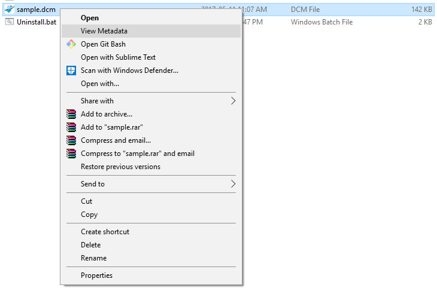

Small script written in python and made into an executable with py2exe.
It allows you to write click any .dcm file and view its metadata using your default text editor.

Installation instructions:

- Download the package
- Run Install.bat as Administrator

Uninstallation instructions:

- Run C:\Scripts\dcminfo\Uninstall.bat as Administrator

Screenshot:  
 
<!--  -->

